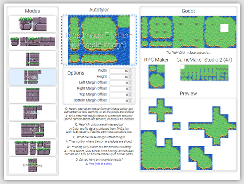
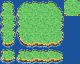
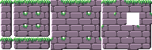
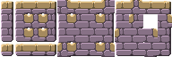

# About

Use it here: https://wareya.github.io/webtyler/

Autotyler JS is an autotile conversion tool for turning small/incomplete autotile tilesets into complete, fleshed-out ones.

It supports seven different input formats and two different output formats, and displays a preview.

Example inputs:

Outputs:

# Extra

Autotyler's "killer feature" that sets it apart from other autotile tilemap conversion tools is the ability to specify exactly where the tiles get cut up (with the "margin offset" options), so you can use tiles with tops that overhang the halfway point without issue:

Also supports outputting RPG maker autotile chipsets:

The intended bitmask for the godot output is the following:

